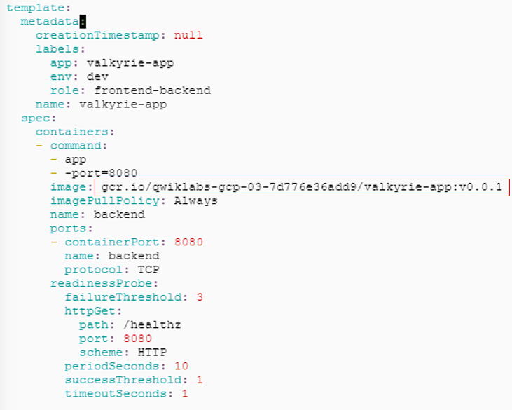
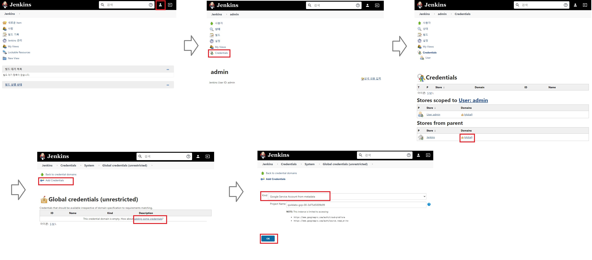
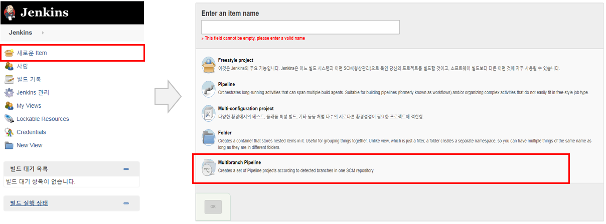
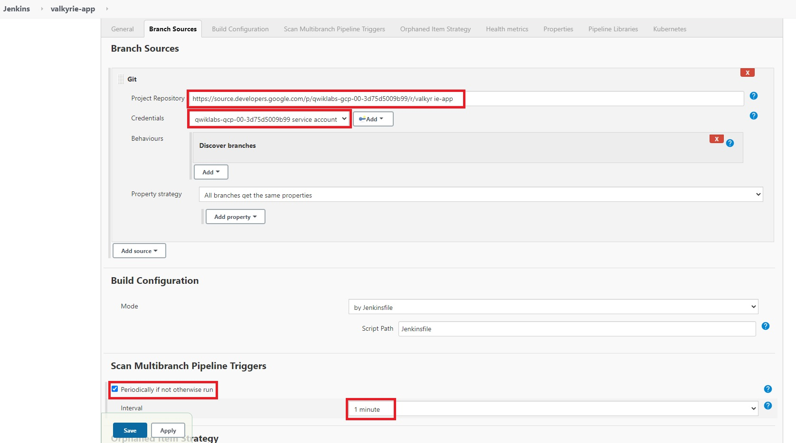
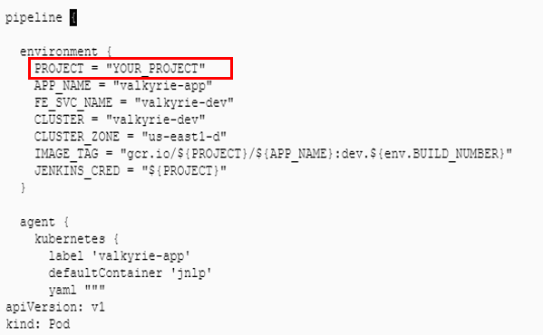

# \[qwiklab\] Kubernetes in Google Cloud: Challenge Lab

**\[GSP318\] Kubernetes in Google Cloud: Challenge Lab**의 Hands-on 입니다.  
Challenge의 과정 내용은[ 퀵랩 사이트](https://google.qwiklabs.com/focuses/10457?parent=catalog)를 통해 참고하여 주세요. 모든 수행과정은 퀵랩의 순서로 진행됩니다.  
이번 Lab은 GKE환경 및 Jenkins를 활용한 배포관리를 경험할 수 있어, 향후 다른 프로젝트 적용시에 참고될 수 있는 Lab 입니다.  
전체 과정을 수행하는데는 약 40여분 정도 소요 됩니다.

퀵랩 시나리오:

* Create a Docker image and store the Dockerfile.
* Test the created Docker image.
* Push the Docker image into the Container Repository.
* Use the image to create and expose a deployment in Kubernetes
* Update the image and push a change to the deployment.
* Create a pipeline in Jenkins to deploy a new version of your image when the source code changes

과정을 보다 원활히 수행하기 위해 Cloud Shell 에서 먼저 프로젝트ID와 Compute의 Zone을 환경변수로 등록하여 줍니다.

```text
export PROJECT_ID=$(gcloud info --format='value(config.project)')

gcloud config set compute/zone us-east1-d
```

## Task 1: Create a Docker image and store the Dockerfile <a id="step4"></a>

* Task의 단계별 체크를 위해 setup\_marking.sh를 다운로드 받습니다.

```text
source <(gsutil cat gs://cloud-training/gsp318/marking/setup_marking.sh)
```

* valkyrie-app의 소스파일을 다운로드 받고, 해당 폴더로 이동합니다.

```text
gcloud source repos clone valkyrie-app --project=${PROJECT_ID} && cd valkyrie-app
```

* `vi Dockerfile` 을 입력해 DockerFile을 생성하고, i로 편집 모드로 진입한 후, 아래 코드를 넣고 esc키 클릭 후 :wq!\(저장 후 종료\) 합니다.

```text
FROM golang:1.10
WORKDIR /go/src/app
COPY source .
RUN go install -v
ENTRYPOINT ["app","-single=true","-port=8080"]
```

* 이제, docker build합니다. 문제에서 docker name은 valkyrie-app, tag는 v0.0.1 입니다.

```text
docker build -t valkyrie-app:v0.0.1 .
```

* docker build가 완료되면 `step1.sh`를 실행하고, 아래의 결과가 나오면 Task1은 완료 됩니다. 사이트에서  **Check my progress**를 클릭하세요.


Image exists  
Go ahead and check the activity tracking on the lab page


## Task 2: Test the created Docker image <a id="step5"></a>

* docker의 buiild 상태를 확인합니다.
* docker를 실행시키고, docker의 실행 상태를 확인 합니다.
* 코드는 한줄 씩 실행시켜 주세요.

```text
docker images

docker run -p 8080:8080 --name valkyrie-app -d valkyrie-app:v0.0.1

docker ps
```

* `step2.sh`를 실행하고 아래의 결과가 나오면 Task2는 완료 됩니다. 사이트에서  **Check my progress**를 클릭하세요.


Container running and visible on port 8080, good job!  
Go ahead and check the activity tracking on the lab page


## Task 3: Push the Docker image in the Container Repository <a id="step6"></a>

* docker 파일을 GCR로 푸시하여 줍니다.
* 코드는 한줄 씩 실행시켜 주세요.
* 코드 실행 후 사이트에서  **Check my progress**를 클릭하세요.

```text
docker tag valkyrie-app:v0.0.1 gcr.io/${PROJECT_ID}/valkyrie-app:v0.0.1

docker push gcr.io/${PROJECT_ID}/valkyrie-app:v0.0.1
```

## Task 4: Create and expose a deployment in Kubernetes <a id="step7"></a>

* Kubernetes로 배포를 하기 위해 **deployment.yaml을 수정**합니다.
* deployment.yaml의 위치는 valkyrie-app/k8s에 있습니다.
* vi편집기로 deployment.yaml의 **IMAGE\_HERE**의 값을 아래 GCR URL로 변경하여 줍니다.

  "`gcr.io/[PROJECT_ID]/valkyrie-app:v0.0.1"`

  \(\[PROJECT\_ID\]에는 Cloud Console의 PROJECT ID를 입력합니다.deployment.yaml의 **IMAGE\_HERE**은 2개가 있으므로, 두 곳 모두 수정해야합니다.\)

* kubectl 명령어로 deployment.yaml과 service.yaml 배포를 적용하고, pod의 상태를 확인 합니다.
* `kubectl get service` 결과에서 EXTERNAL-IP가 생성되었음을 확인하세요.
* 이후 과정의 진행사항 체크를 위해 EXTERNAL-IP를 브라우저 새 탭의 주소창에 입력해서 띄워두세요.
* 코드 실행 후 사이트에서  **Check my progress**를 클릭하세요.
* 코드는 한줄 씩 실행시켜 주세요.

```text
gcloud container clusters get-credentials valkyrie-dev

kubectl apply -f deployment.yaml

kubectl get pod -w 

kubectl apply -f service.yaml

kubectl get service
```

## Task 5: Update the deployment with a new version of valkyrie-app <a id="step8"></a>

* replica set을 3개로 줍니다.
* 아래 코드 실행 후 사이트에서 첫번째 **Check my progress**를 클릭하세요.

```text
kubectl scale deployment valkyrie-dev --replicas=3
```

* pod의 업데이틀 위해 수정된 소스를 git branch에서 merge 합니다.
* 코드는 한줄 씩 실행시켜 주세요.

```text
git merge origin/kurt-dev

git push origin master
```

* 소스 merge가 완료 되면 아래와 같이 GCR에 docker 수정 빌드 하여 줍니다.
* docker build 실행 전, **Dockerfile이 있는 위치\(valkyrie-app\)에서 docker build를 실행**하여 주세요.
* 코드는 한줄 씩 실행시켜 주세요.

```text
docker build -t valkyrie-app:v0.0.2 .

docker tag valkyrie-app:v0.0.2 gcr.io/${PROJECT_ID}/valkyrie-app:v0.0.2

docker push gcr.io/${PROJECT_ID}/valkyrie-app:v0.0.2
```

* 아래 명령어를 통해 **\*\*Kubernetes의 배포에서** image 태그를 v0.0.2로 수정\(2곳 수정 필요\)\*\*하고, 결과를 확인 합니다.
* **Web Preview**를 통해 테이블 색이 green으로 변경되었는지 확인 합니다. \(업데이트가 실시간으로 잘 안될경우, `kubectl get service`를 통해 확인된 EXTERNAL-IP를 브라우저 새 탭의 주소창에 입력한 탭을 새로고침하여 확인\)
* 사이트에서 두번째 **Check my progress**를 클릭하세요.

```text
kubectl edit deployment valkyrie-dev
```



## Task 6: Create a pipeline in Jenkins to deploy your app <a id="step9"></a>

대망의 마지막 Task 입니다. 😃

* 아래 명령어를 통해 실행중인 docker를 종료 시켜주세요.
* CONTAINER\_ID는 docker ps에서 나온 ID를 넣어 주세요.

```text
docker ps
docker stop CONTAINER_ID
```

* 아래 명령어로 Jenkins의 admin password를 확인 합니다. `printf $(kubectl get secret cd-jenkins -o jsonpath="{.data.jenkins-admin-password}" | base64 --decode);echo`
* 아래 명령을 사용하여 Jenkins를 실행시키고, **Web Preview**로 사이트가 열렸는지 확인 합니다. 사이트에서 ID는 admin, PW는 위에서 확인 패스워드를 입력해서 로그인합니다.

```text
export POD_NAME=$(kubectl get pods --namespace default -l "app.kubernetes.io/component=jenkins-master" -l "app.kubernetes.io/instance=cd" -o jsonpath="{.items[0].metadata.name}")

kubectl port-forward $POD_NAME 8080:8080 >> /dev/null &
```

* Jekins사용하기 위해 GCP의 프로젝트/소스저장소를 연결하여 줍니다.
  * 오른쪽 위 사람모양 클릭 
  * 왼쪽 Credentials 클릭
  * Stores from parent 의 global 클릭
  * 가운데  adding some credentials 또는 왼쪽의 Add Credentails 클릭
  * Google Service Account from metadata 선택, Project Name 확인, OK 클릭
  * 왼쪽 위 Jenkins 클릭하여 메인페이지 이동 
  * 새로운 item 클릭, valkyrie-app 입력\(item명은 자율\), Multibranch Pipeline 선택 후 OK 클릭
  * Branch Sources에서 Git 선택
  * GCP Consol에서 `gcloud source repos list`를 통해 소스저장소 URL을 확인\(https://source.developers.google.com/p/\[PROJECT\_ID\]/r/valkyrie-app 의 형식, \[PROJECT\_ID\]에는 Cloud Console의 PROJECT ID를 입력합니다.\)
  * 해당 URL을 복사하여 Repository URL에 붙여넣고, Credentials를 프로젝트 ID로 선택
  * Scan Multibranch Pipeline Triggers에서 Periodically if not otherwise run 체크 후, Interval 은 1minite으로 설정 후 Apply, Save 클릭 







* valkyrie-app에 있는 Jekinsfile을 vi로 열고 Jenkinsfile의 "YOUR PROJECT"를 Console의 Project ID로 수정하여 줍니다.



* source에 위치한 html.go 파일을 vi편집기를 사용하여 green 2곳을 orange로 수정 후, 아래 git 명령어를 통해 파일을 업데이트 하여 줍니다.
* 업데이트 전에는 git에 대한 USER\_ID와 USER\_NAME을 설정하여 줍니다.
* 이 때, 좀전에 수정한 `Jenkinsfile`과 `Dockerfile`도 같이 업로드 되도록 하여 줍니다.
* 경로를 `valkyrie-app`폴더로 이동합니다.
* 초기 빌드에는 시간이 걸리므로, 실행중인 프로세스를 Console Output을 통해 모니터링하십시오.
* 빌드가 완료되면 테이블 색이 orange로 변경되었는지 확인 합니다.
* 사이트에서 마지막  **Check my progress**를 클릭하세요.

```text
git config --global user.email "student@qwiklabs.net"
git config --global user.name "Qwiklab breaker"
git add .
git commit -m "card color change to orange"
git push origin master
```

## Congratulations!

* 퀘스트 완료 축하합니다!!


2020 3/18에 업데이트된 자료를 기반으로 작성되었습니다.


