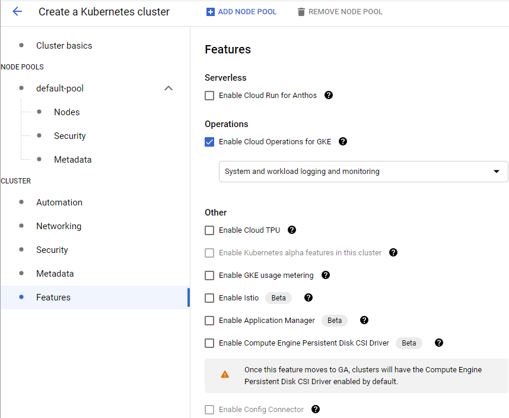

# GKE 뽀개기

### 1. GKE\(Google Kubernetes Engine\)란

GKE\(Google Kubernetes Engine\)는 Google Cloud Platform이 제공하는 Managed 서비스입니다.

### 2. GKE 시작하기

### Task1. GKE Cluster 생성하기

먼저 클러스터 생성을 위해서는 Google Kubernetes Engine API가 사용 설정이 필요합니다.  
GKE 메뉴에 접근하게 되면, 자동으로 enable 됩니다.

클러스터 생성화면에 들어가면, 3가지의 메뉴트리로 구성됩니다.

* **Cluster basis**   - 클러스터의 위치 및 버전 선택
* **Node Pools**
* **Cluster**

#### Cluster basics

**Location Type**

* **Zonal** -  Google Cloud의 데이터 센터에 master node가 하나의 Zone에만 존재하는 형태입니다.    따라서, Cluster master의 **고가용성\(High Availability\)**를 보장하지 않습니다. - 한국 리전은 3개의 Zone으로 구성되어 있습니다.
* **Regional** - 고가용성을 보장하기 위해 region 안에 zone 별로 하나씩 master node를 생성합니다.
* **Specify default node location** - Default node locations를 여러개 지정해서 multi-zonal cluster를 구성할 수 있습니다.

**Master version**

* **Static version** - 버전을 고정으로 사용.
* **Release version** - Kubernetes 버전의 automatic upgrade를 지원받을 수 있습니다.
  * Rapid channel - 오픈 소스 Kubernetes가 GA\(General Availability\)된 뒤 몇 주 안에 릴리즈됩니다.
  * Regular channel - Rapid가 업데이트된 후 2~3개월 후에 릴리즈
  * Stable channel - Regular보다 다시 2~3월 후에 문제가 없다는 것이 확인된 후 릴리즈. \(상용환경을 구성 시 Stable Recommand\)

**Node Pools**

Node pool은 같은 종류의 노드의 집합을 의미합니다. EKS의 node group에 해당합니다.  
Node는 결국 GCE\(VM\) 이기 때문에 이미지 타입과 머신 타입 등을 설정하게 되어 있습니다.

**Node Pool details**

* Release version을 stable로 해놔서 Automation이 default로 enabled된 것을 확인할 수 있다.

**Surge Update**

Node의 Kubernetes version 업그레이드 시 node를 몇개까지 더 늘이고 줄일 수 있는지를 결정합니다.  
Max surge = 1 \(업그레이드 시 1개 node를 더 생성 함\)  
Max unavailable = 0\(사용 가능한 node 수가 업그레이드 전의 node 수보다 더 적게 되지는 않도록 함\)  
즉, 새 버전의 node 1개를 추가한 뒤 하나의 node를 종료하고, 다시 새 버전의 node 1개를 추가하기를 반복하면서 node를 업그레이드 하게 됩니다.

**Node**

**Image type**

* **cos:** Optimized for security and performance
* **cos\_containerd:** cos, using containerd as the main container runtime directly integrated with Kubernetes
* **Ubuntu:** Supports NFS, GlusterFS, XFS, Sysdig, and Debian packages.
* **Ubuntu\_containerd:** Ubuntu, using containerd as container runtime
* **Windows Server Semi-Annual Channel:** Windows option best for containerized apps, ~2 new releases every year
* **Windows Server Long-Term Servicing Channel:** Windows option best for traditional apps, 1 new release every 2-3 years


이 부분도 선택의 중요성이 대두되는 시기가 곧 오리라 봅니다.  
나중에 다시 정리하는 것으로....


**Machine Family**

AWS와 마찬가지로 용도에 따라 선택가능한 자원의 리스트가 늘어나고 있습니다.  
목적에 맞는 자원의 선택이 더욱 중요해지고 있습니다.  
Default 세팅으로 진행 합니다. GENERAL-PURPOSE E2 Series E2-medium\(2vCPU, 4GB momory\)

**Boot disk size**

실용적으로 쓸 수 있는 boot disk 크기는 32GB 정도되나, Default로 진행합니다.

**Enable preemptible nodes**

Preemptible nodes란 최대 24시간까지만 지속되는 인스턴스입니다.  
****이 옵션을 체크하면 cluster에서 preemptible nodes를 사용할 수 있습니다.


Security와 metadata 등의 옵션은 Default로 두어도 무방합니다.


**Cluster**

**Automation**

**Enable Maintenance Window**

auto upgrade를 진행할 시간을 지정할 수 있는 기능입니다. 안정성 측면에서 트래픽이 가장 적은 새벽 시간 등으로 설정해 두시면 좋습니다.  
설정하지 않으면, GKE는 Kubernetes version upgrade를 아무때나 진행할 수 있습니다.

**Enable node auto-provisioning**

Node auto-provisioning은 자동으로 새로운 node pool을 생성하고 삭제하는 기능입니다. 이 기능을 활성화하지 않으면 GKE는 미리 정해진 node pool 중에서만 새 node를 생성합니다. 하지만 node auto-provisioning 기능을 사용하면 새로운 node pool을 GKE가 직접 생성할 수 있습니다.

**Neworking**

**Private cluster**

Private cluster으로 설정하면 public ip address를 갖지 않고 public internet과 연결되지 않습니다.  
따라서, inbound, outbound 연결을 할 수 없습니다. Private cluster의 특정 node에 outbound internet access를 주고 싶다면 NAT 등을 통해야 합니다.

**Enable VPC-native traffic routing**

타사의 관리형 Kubernetes 와 다르게 Google cloud 만이 제공할 수 있는 기능으로 별도의 NAT 없이도 독립적인 Kubernetes 의 네트워크 구조를 사용하는 GKE 를 다른 Google cloud 서비스와 바로 연동할 수 있도록 Google cloud 의 VPC 와 엮는 옵션입니다. ****다른 GCP 서비스들과 internal IP로 편리하게 통신할 수 있도록 하기 위해서 이 기능을 활성화하는 것이 좋습니다. \(기본적으로 enabled 되어 있습니다.\)

**Security**

**Enable Shielded GKE Nodes**

GKE 노드의 보안을 강화하는 옵션으로 1.18 GA 이후부터 default 로 세팅됩니다. [Learn more](https://cloud.google.com/kubernetes-engine/docs/how-to/shielded-gke-nodes?_ga=2.182961190.-1082704195.1572261901&_gac=1.61378654.1606742235.Cj0KCQiAzZL-BRDnARIsAPCJs71diWVTbYutIeFNVyYKdFTxz1M1un7gTWojN55dM8VEQCHVDhvXD9YaAhexEALw_wcB#about)

**Features**

**Operations**

과거 Stackdriver라고 불리다가 Operations로 이름이 바뀌었습니다. 활성화해두시면 대시보드 등으로 클러스터를 쉽게 모니터링할 수 있습니다. \(defalut로 enabled 되어 있습니다.\)

### **3. GKE 살펴보기**

생성된 GKE cluster 의 이름을 클릭하면 하단과 같이 상세 정보를 확인할 수 있습니다.

Nodes 탭을 클릭하면 Node 명과 기본적인 정보들을 확인할 수 있으며 이전에 GKE cluster 를 만들때 기본 사이즈 3으로 설정했기 때문에 3개의 Node 를 확인가능 합니다.

Storage 탭을 클릭하면 GKE cluster 에 할당된 storage 를 확인할 수 있습니다.

각 Node 를 클릭하면 좀 더 상세한 모니터링 정보와 Pods 정보를  확인 가능합니다.

Monitoring 메뉴에서 더 자세한 메트릭이 확인 가능합니다. \(예전 StackDriver가 GCP로 완전히 이식되어 상용화 된것 같습니다.\)

Applications 메뉴는 GKE cluster 를 조금 더 쉽게 활용하게 할 수도 있고**,** Marketplace 에서 파트너를 통해서 제공되는 다양한 Kubernetes 애플리케이션을 설치해서 바로 사용할 수 있는 메뉴입니다.

여기까지 기본적인 GKE Cluster에 대한 내용들에 대해알아보았습니다.  
다음은 생성된 환경위에 샘플 Application 배포를 통해 테스트를 해보겠습니다.

### **4. Sample Application 배포하기**

\*\*\*\*

\*\*\*\*

